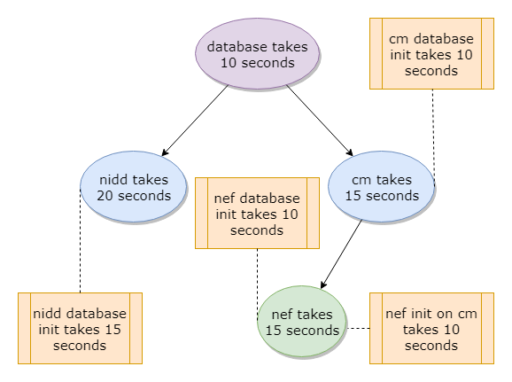

# Cloud Native Initialization - Proof of concept

## Introdution

We have 3 methods to do the cloud native initialization task：

1. Initialize with Helm pre-install hook and initialization containers

    **If the hook depends on the service that will be installed, it will cause a deadlock.**

2. Initialize with Helm post-install hook and initialization containers

    **If the hook depends on the service that will be installed，and given wrong
    priority (hook weight), it will cause a deadlock.**

    **When we assign the correct priority to the hook, the hook executes serially,
     and the wait time will not be as long as necessary.**

3. Initialize with Kubernetes job and initialization containers

    **Without careful tuning of task priorities, it will complete the initialization
     work in the correct priority and shortest time.**

    Since there is no helm to clean up, only the data required for initialization
    will remain in the cluster, and the Kubernetes environment will looks a bit messy.

## Setup

The demo program requires the following prerequisites：

- Kubernetes environment
- The host address and port used to display the execution information
- Running netcat in the specified host address and port

## Proof of concept

### Cloud Native Initialization - Demo program

This demo program contains 2 Microservice services, monte and nidd, all of
which depend on the database.
Let's assume that the startup time for these services and databases,
monte takes 15 seconds, nidd takes 20 seconds, database takes 10 seconds. For the initialization time, monte takes 10 seconds, nidd takes 15 seconds.

### Initialize with Helm pre-install hook and initialization containers

### Initialize with Helm post-install hook and initialization containers

### Initialize with Kubernetes job and initialization containers
